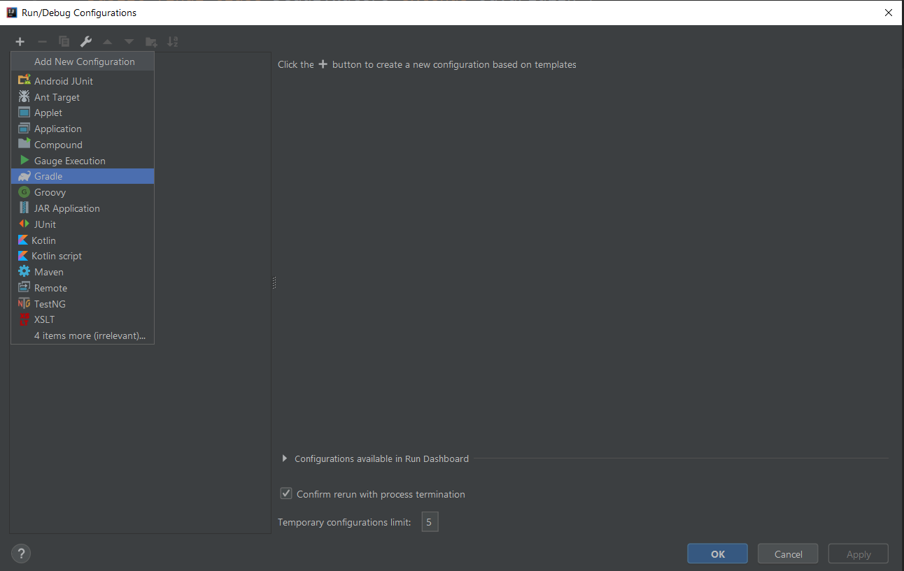

A quick tutorial on setting up a Spigot plugin, specifically for cloning MineInAbyss' existing projects on GitHub. 

Wouldn't be surprised if I missed something, so ask questions in `#plugin-dev` on our discord. 

\- Offz

## Contents:

* Setting up
* Forking and cloning a git project
* Importing and building with Gradle
* Further reading

## Setting up:

###### For setting up your coding environment:

* Install [Java JDK 8](https://www.oracle.com/technetwork/java/javase/downloads/jdk8-downloads-2133151.html), you need to click **Accept License Agreement** and select your OS. For all of these, you can pretty much just click through the installers until they finish.
* Install [IntelliJ](https://www.jetbrains.com/idea/), our recommended Java IDE. Click on the Community edition when downloading, since Ultimate is paid for.
* Install [git](https://git-scm.com/downloads).

###### For setting up the server:

* Get the [Paper jar](https://papermc.io/downloads#Paper-1.13). We are currently sticking to Minecraft `1.13.2`. Install Paper with [this guide](https://paper.readthedocs.io/en/stable/server/getting-started.html).

## Forking and cloning a git project

First, open IntelliJ, you should see a [welcome screen](https://www.jetbrains.com/help/idea/welcome-screen.html).

Git is a common tool used for collaborating and sharing code. To start coding on an existing project, you need to clone or fork it (forking will allow you to contribute code back). Realistically, you don't need much knowledge of git to start coding plugins, but you will need a GitHub account to contribute back to our projects.

[Here](https://try.github.io/) is a great series of tutorials on both Git and GitHub. I suggest looking at the *GitHub Learning Lab* whenever you have time.

Once you have a GitHub account, [this video](https://youtu.be/lyiBnyPPnG4) covers how to fork and import a git project (look at 3:45 to see how to import a project from the welcome screen). 

You're basically making a copy of the project for yourself, to which you can make whatever changes you want to, without affecting the real project. Later on, you will submit a *pull request*, to get your changes accepted into the original project.

Next, [set your project SDK](https://www.jetbrains.com/help/idea/sdk.html). You can use the shortcut `Ctrl+Alt+Shift+S` on Windows, then click on the `Project` tab. Chances are, you'll need to create a new SDK with the `New` button. On Windows, Java installs itself in `C:\Program Files\Java`. You just need to select the `jdk1.8.0_...` folder inside of it. [Here's](https://www.youtube.com/watch?v=eqpBTw5dO9w) a video just in case you need it!

The MineInAbyss project requires you to also clone DeeperWorld, but you don't need to fork it if you aren't planning to make any changes to it. You can just checkout from version control with its .git link `https://github.com/MineInAbyss/DeeperWorld.git`.

## Importing and building with Gradle

Gradle is a tool that simplifies how we import libraries, in our case, we use it to import Spigot, and have access to all of its classes. You don't need to worry about how it works yet, just how to build the plugin's jar file with it, however, feel free to look at [this video](https://www.youtube.com/watch?v=JwPYjnhah3g) to learn more about it.

When you clone your project, IntelliJ should show a little popup window noting that you have an unlinked Gradle project. Click `Import Gradle project`. If you accidentally closed the window, click on the `Event Log` button in the bottom right and find the message.

Once you click the button, you will be greeted with a Gradle import window, with similar options to those you get when creating a new Gradle project. You really only care about the `Gradle JVM:` box, which should be set to `Use Project JDK`. Then, just press `OK`. If you get an error related to the JDK, you need to set your project SDK!

Now, Gradle will begin to import everything we've defined (namely Spigot) for you to use.

If you look in any of the plugin's Java files, you shouldn't see any errors, and you should be able to use all of Spigot's classes to start coding your plugin!

There's one last thing you need though. You can code all you want right now, but without building a jar file, you won't be able to test your plugin. The jar file is what you'll actually put in your plugins folder, and our Gradle configuration can actually move it in there automatically!

To build the project, you need to click on the `Add Configuration` button in the top right, 

In the window that opens, press `+`, then click `Gradle`

Next, you can select the `Gradle project` by clicking the little folder with the blue square to the right. For our simpler plugins, you will only have one option, but for the main `MineInAbyss` plugin, you want to select the inner `MineInAbyss:MineInAbyss` project. This is because it uses and API which we've separated into a separate Gradle project. Next, in `Tasks` type build. Finally, give the configuration a name. It should end up looking similar to this.

If you press `OK`, then click the little green triangle (or `Shift+F10` on Windows) the project should begin to build!

The last thing we'll do is configure a copy path in the `build.gradle`. In your left project sidebar, locate the `build.gradle` file (for MineInAbyss, you need to open the inner one).

Inside, you can uncomment the `copyJar` task, and set the directory to wherever your plugins folder is.

Notice that this registers as a change in git, so sometimes people end up pushing their own `copyJar` task, when everyone else doesn't use that directory. To solve this, you can make a new changelist in IntelliJ, which will stop you from accidentally committing your changes here. The video below shows how:

Well, now it's finally time to celebrate your first step into actually beginning to work on one of the projects :tada::tada::tada:

## Further reading​​

I'll be making a tutorial on starting a brand new Spigot plugin with Gradle soon:tm:, also maybe a proper tutorial series but :man_shrugging:

For now, looking around a bit, I found [this series](https://www.youtube.com/watch?v=ZlWkKnNiO-0&list=PLdnyVeMcpY7-d7w7QVJ9dTlBoxb4xt_aN&index=4), which looks like it should cover enough basics to get you started. You can use the [Spigot Javadoc](https://hub.spigotmc.org/javadocs/spigot/index.html?overview-summary.html) to find what classes do what once you get the hang of basics. Just Googling any questions can also often bring up existing forum threads about problems.